# Automated Python Docstring Generator

<div align="center">

[](https://pypi.org/project/docstringsiva/)
[](https://python.org)
[](https://opensource.org/licenses/MIT)
[](https://peps.python.org/pep-0257/)
[](https://streamlit.io)

**🚀 AI-Powered Docstring Generation & PEP-257 Validation for Python Code**

</div>

---

## 📋 Table of Contents

- [✨ Features](#-features)
- [📦 Installation](#-installation)
- [⚡ Quick Start](#-quick-start)
- [⚙️ Configuration](#️-configuration)
- [🔄 Example Workflows](#-example-workflows)
- [🧪 Testing](#-testing)
- [🤝 Contribution](#-contribution)
- [📄 License](#-license)
- [💬 Support](#-support)

---

## ✨ Features

<div align="center">

| Feature | Description | Status |
|:-------:|:-----------:|:------:|
| 🤖 **Auto-Generation** | Generate docstrings for functions & classes | ✅ |
| 📐 **PEP-257 Validation** | Validate against PEP-257 standards | ✅ |
| 🎨 **Multi-Style Support** | Google, NumPy, reStructuredText | ✅ |
| 📊 **Coverage Reports** | Measure documentation coverage | ✅ |
| 🖥️ **Streamlit UI** | Interactive web interface | ✅ |
| 🔧 **CLI Tools** | Command-line batch processing | ✅ |
| 🧪 **Edge Case Tests** | Comprehensive test coverage | ✅ |
| 📦 **PyPI Package** | Easy pip installation | ✅ |

</div>

### 🎯 Key Capabilities


---

## 📦 Installation

### From PyPI (Recommended)

```bash
pip install docstringsiva
```

### From Source (Development Mode)

```bash
# Clone the repository
git clone https://github.com/sivasankar3002/Automated-Python-Docstring-Generator.git
cd Automated-Python-Docstring-Generator

# Install in editable mode with all dependencies
pip install -e ".[dev,ui]"
```

### Installation Options

| Option | Command | Installs |
|:------:|:-------:|:--------:|
| **Core** | `pip install docstringsiva` | Core library + CLI |
| **Dev** | `pip install "docstringsiva[dev]"` | + pytest, black, mypy |
| **UI** | `pip install "docstringsiva[ui]"` | + Streamlit |
| **Full** | `pip install "docstringsiva[dev,ui]"` | Everything |

---

## ⚡ Quick Start

### 🖥️ Using the CLI

Validate docstring coverage and PEP-257 compliance:

```bash
# Basic validation
docugenius myfile.py

# Multiple files
docugenius src/module_a.py src/module_b.py

# Custom thresholds
docugenius myfile.py --min-coverage 90 --min-compliance 85

# Generate JSON report
docugenius myfile.py another_file.py --output report.json
```

### 📋 CLI Options Reference

| Option | Type | Default | Description |
|:------:|:----:|:-------:|:-----------:|
| `files` | positional | - | `.py` files to analyse |
| `--min-coverage` | float | 90.0 | Minimum coverage % |
| `--min-compliance` | float | 85.0 | Minimum compliance % |
| `--output` | string | - | JSON report path |
| `--style` | string | google | Docstring style |

### 🎛️ Exit Codes

| Code | Meaning |
|:----:|:--------|
| `0` | ✅ All files meet thresholds |
| `1` | ❌ One or more files failed |

---

### 📚 Using as a Library

```python
from docstringsiva import DocstringGenerator, DocstringValidator
from m2_core import CodeInstrumentor

# Read source code
source_code = open("myfile.py", encoding="utf-8").read()

# Generate/inject docstrings
instrumented = CodeInstrumentor.add_docstrings(source_code, style="google")

# Validate quality before/after
quality_before = DocstringValidator.analyze_code_quality(source_code)
quality_after = DocstringValidator.analyze_code_quality(instrumented)

print(f"Coverage before: {quality_before['coverage_percentage']}%")
print(f"Coverage after:  {quality_after['coverage_percentage']}%")
print(f"Compliance after: {quality_after['compliance_percentage']}%")
```

---

### 🌐 Using the Streamlit UI

```bash
# Install UI dependencies
pip install "docstringsiva[ui]"

# Launch the web interface
streamlit run streamlit_app.py
```

<div align="center">


</div>

---

## ⚙️ Configuration

Configure DocuGenius using `pyproject.toml` in your project root:

```toml
[tool.docugenius]
style = "google"              # google, numpy, or reST
min_coverage = 90.0           # Minimum coverage percentage
min_compliance = 85.0         # Minimum compliance percentage
exclude_patterns = [
    "tests/**", 
    "venv/**",
    "__pycache__/**"
]
```

### 📖 Configuration Options

| Setting | Type | Default | Description |
|:-------:|:----:|:-------:|:-----------:|
| `style` | string | `google` | Docstring format style |
| `min_coverage` | float | `90.0` | Minimum documentation coverage |
| `min_compliance` | float | `85.0` | Minimum PEP-257 compliance |
| `exclude_patterns` | list | `[]` | Files/directories to skip |

### 🎯 Where Configuration is Used

| Component | Reads Config | Override Via CLI |
|:---------:|:------------:|:----------------:|
| **CLI** | ✅ Yes | ✅ Yes |
| **Streamlit UI** | ✅ Yes | ✅ Via UI |
| **Library API** | ❌ No | ✅ Via Parameters |

---

## 🔄 Example Workflows

### 1️⃣ Enforce Docstring Quality in CI

```mermaid
graph TD
    A[Push Code] --> B[GitHub Actions]
    B --> C[Install DocuGenius]
    C --> D[Run Validation]
    D --> E{Coverage ≥ 90%?}
    E -->|Yes| F[✅ Pass]
    E -->|No| G[❌ Fail]
```

<div align="center">



</div>

**Step 1:** Add `pyproject.toml` with thresholds:

```toml
[tool.docugenius]
style = "google"
min_coverage = 80.0
min_compliance = 85.0
exclude_patterns = ["tests/**", "venv/**", "build/**"]
```

**Step 2:** Add to CI pipeline (GitHub Actions):

```yaml
# .github/workflows/docstrings.yml
name: Docstring Validation

on: [push, pull_request]

jobs:
  validate-docstrings:
    runs-on: ubuntu-latest
    steps:
      - uses: actions/checkout@v3
      - name: Set up Python
        uses: actions/setup-python@v4
        with:
          python-version: '3.9'
      - name: Install DocuGenius
        run: pip install docstringsiva
      - name: Validate Docstrings
        run: docugenius src/**/*.py
```

---

### 2️⃣ Improve Documentation for Legacy Project

```bash
# Step 1: Install with UI
pip install "docstringsiva[ui]"

# Step 2: Launch Streamlit
streamlit run streamlit_app.py

# Step 3: Upload your code
# - Single .py file → Detailed metrics
# - ZIP archive → Project-wide analysis

# Step 4: Download instrumented code & reports
```

<div align="center">

| Upload Type | Output | Best For |
|:-----------:|:------:|:--------:|
| 📄 Single `.py` | File metrics | Quick validation |
| 📦 ZIP Archive | Project metrics | Full project analysis |

</div>

---

### 3️⃣ Integrate into Custom Tool

```python
from m2_core import CodeInstrumentor, DocstringValidator

def ensure_docs(path: str, style: str = "google") -> None:
    """Ensure a file has proper documentation."""
    content = open(path, encoding="utf-8").read()
    
    # Analyze before
    quality_before = DocstringValidator.analyze_code_quality(content)
    
    # Add docstrings
    instrumented = CodeInstrumentor.add_docstrings(content, style=style)
    
    # Analyze after
    quality_after = DocstringValidator.analyze_code_quality(instrumented)
    
    print("Before:", quality_before["coverage_percentage"])
    print("After:", quality_after["coverage_percentage"])
```

---

## 🧪 Testing

### Run Test Suite

```bash
# Install test dependencies
pip install "docstringsiva[dev]"

# Run all tests
pytest

# Run with coverage
pytest --cov=m2_core --cov-report=html

# Run specific test file
pytest tests/test_edge_cases.py -v
```

### Edge Cases Covered

<div align="center">

| Test Case | Description | Status |
|:---------:|:-----------:|:------:|
| 📄 Empty Files | Handle empty Python files | ✅ |
| 🔀 Nested Functions | Functions within functions | ✅ |
| 🎭 Decorated Functions | Functions with decorators | ✅ |
| 🏛️ Classes Without Methods | Empty class bodies | ✅ |
| ✅ Already Documented | Skip existing docstrings | ✅ |
| ⚠️ Syntax Errors | Graceful error handling | ✅ |
| 🔄 Generator Functions | Handle yield statements | ✅ |
| ⚡ Async Functions | Handle async/await | ✅ |
| 📝 Type Annotations | Preserve type hints | ✅ |

</div>

---

## 🤝 Contribution

### Setting Up Development Environment

```bash
# Clone repository
git clone https://github.com/sivasankar3002/Automated-Python-Docstring-Generator.git
cd Automated-Python-Docstring-Generator

# Create virtual environment
python -m venv venv
source venv/bin/activate  # Linux/Mac
# or
venv\Scripts\activate     # Windows

# Install development dependencies
pip install -e ".[dev,ui]"
```

### Contribution Guidelines

| Requirement | Description |
|:-----------:|:-----------:|
| 📐 **Coding Style** | Follow PEP 8, PEP-257 compliant docstrings |
| 🧪 **Testing** | Add/update tests in `tests/` for new features |
| 📝 **Commits** | Clear, descriptive commit messages |
| 🔍 **Code Review** | Run `pytest` locally before PR |

### Pull Request Process


---

## 📄 License

<div align="center">

[](https://opensource.org/licenses/MIT)

This project is licensed under the **MIT License** - see the [LICENSE](LICENSE) file for details.

</div>

---

## 💬 Support

<div align="center">

| Need Help? | Contact |
|:----------:|:-------:|
| 🐛 **Bug Reports** | [GitHub Issues](https://github.com/sivasankar3002/Automated-Python-Docstring-Generator/issues) |
| 💡 **Feature Requests** | [GitHub Discussions](https://github.com/sivasankar3002/Automated-Python-Docstring-Generator/discussions) |
| 📧 **Questions** | [Open an Issue](https://github.com/sivasankar3002/Automated-Python-Docstring-Generator/issues) |
| 🤝 **Contributions** | [Pull Requests](https://github.com/sivasankar3002/Automated-Python-Docstring-Generator/pulls) |

</div>

---

<div align="center">

### 📊 Project Stats

[](https://pypi.org/project/docstringsiva/)
[](https://github.com/sivasankar3002/Automated-Python-Docstring-Generator)
[](https://github.com/sivasankar3002/Automated-Python-Docstring-Generator)

---

**Made with ❤️ by the DocuGenius Team**

[](https://pypi.org/project/docstringsiva/)
[](https://github.com/sivasankar3002/Automated-Python-Docstring-Generator)

</div>
